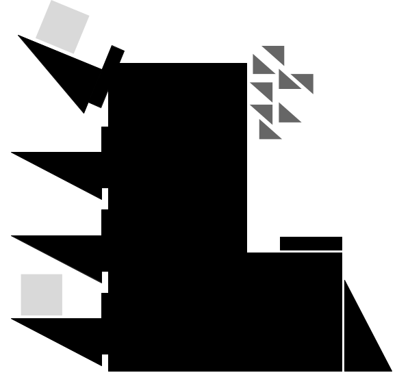

# Civboot:  a civilizational bootstrapper 

Civboot: a self-bootstrapping technology stack for modern civilization.

What is a Civboot? Imagine a factory capable of building a minimalist
general-purpose personal computer, like something from the 80's/90's or better.
A Civboot factory is one which can build such a factory from raw materials.

Today's technology stack and supply chain are too large and complex to be able
to reproduce or understand from books or working examples.  Simplifying parts of
our technology stack has many benefits:

1. Provides a learning reference which can be extrapolated from.
2. Creates a base to modify and branch new ideas.
3. Allows adaptability if supply chains are disrupted or resources are scarce,
   especially in places with fewer resources.

The goal of Civboot is to follow the bellow process for each technology stack
(i.e. software, precision engineering, semiconductor fabrication, etc):

1. Reduce its complexity to something more replicatable and understandable.
2. Build a working system from as simple of tools as possible.
3. Document that system and its construction.
4. Repeat until it can rebuild itself.

The above should be continued for all technology stacks required to build the
crown jewel of justified complexity in our Civilization: the computer.

Unfortunately, modern computers require a large and complex supply chain
including multi-billion dollar silicon fabrication facilities. These require
other billion dollar industries for their custom precision engineered tools,
which themselves depend on other industries, etc. To be able to construct a CPU
(and an entire Civboot) at a small scale (i.e. a university) we will likely need
to pursue different technologies, such as [Thin Film Transistors][TFT] which can
be made using low temperature processes on glass (instead of pure silicon).

These CPUs will be more rudimentary than the 2GHz with 8GiB of RAM we find in
modern smartphones. Therefore, we will also need simpler software -- something
like 100MHz CPUs with only a 10MiB of memory.

The Civboot stack will not be built in a night. It will require probably
hundreds of interested people working in many different fields. All Civboot
components should be designed so that parts of them can be built with off the
shelf components. The end goal is that _every component_ can be built inside a
Civboot. "Every component" means not just that you could use a Civboot to build
a CPU, it means **you can use a Civboot to build a Civboot** from only raw or
recycled materials.

Once a stack can be self-replicated we should keep iterating on the process.
Make each sub-stack:

1. Better, simpler and cheaper to build
2. Easier to learn
3. More concisely documented
4. Repeat

Even if we fail, it will be worth the effort. Having a simplified
working-understanding of technology has many advantages other than the
construction of a Civboot.

## Non-goals

Civboot only contains needs to contain working prototypes and tutorials which
provide a _working knowledge_ of how to reconstruct and improve the Civboot.
Deeper understanding of things like transistors, hardware architecture, software
architecture, chemistry, mechanical engineering, etc can take potentially a
lifetime of learning. It is hoped that Civboot can be a foundation for that
learning, but Civboot itself aims to provide only a working understanding.

## Progress
The following are what is necessary to complete a Civboot. Items without nested
bullet points are not currently being worked on directly.

* [ ] Minimalist software stack. The goal is that each "major layer" should be
  ~1-2 thousand lines of readable code and "core" tests.
  * [x] The [cxt][cxt] documentation syntax.
  * [x] The [zoa][zoa] cross-language serialized data format.
  * [ ] The [fngi][fngi] programming language
    * [X] <1k line C file bootstrapps spor assembly language and runtime
    * [X] <1k lines of spor bootstrapps fngi syntax
    * [X] <1k lines of fngi bootstrapps core syntax elements (`fn`, `if`,
      `loop`, `struct`)
    * [ ] type checking
    * [ ] std library (string, regex, core data structures, zoa, etc)
* [ ] Minimalist Operating System with core utilities. Again, each tool should
  ideally contain only a few thousand lines of code. *As simple as possible but
  no simpler*
  * [ ] Scripting language, better than bash probably good at processing
    data-flows. The [D database language][D database language] tutorial provides
    inspiration.
  * [ ] Cross compiling IR compiler, [QBE][QBE] provides inspiration.
  * [ ] Text editor + "shell". Vim and Jupiter notebooks provide inspiration.
  * [ ] Operating System. The [OberonOS][OberonOS] and [CollapseOS][CollapseOS]
    provide inspiration and demonstrate what is possible: an operating system in
    < 10,000 lines of code with cross compilers and editing utilities. To a
    lesser degree Linux/BSD/Plan9 give some inspiration.
  * [ ] Version control and bug-tracking software [ugit][ugit] and
    [fossil][fossil] provide inspiration.
  * [ ] Learning system. [Khan Academy][Khan Academy] provides inspiration.
  * [ ] Software defined 2D-CAD Modeling. [ImplicitCAD][ImplicitCAD] provides
    inspiration.
  * [ ] Networking stack. [Networks from scratch][NFS] seems like a good start,
        [PJON][PJON] provides inspiration
* [ ] A reduced (only what's necessary for Civboot) version of the [Global
  Village Construction Set][OSE] and built using Civboot software
* [ ] Photo Optics (lenses) fabrication and working knowledge.
* [ ] Precision Engineering fabrication and working knowledge. Simplifying this into working
* [ ] Electronics (non-semiconductor) fabrication and working knowledge (Electrical
  Engineering)
* [ ] Semiconductor fabrication and working knowledge (Electrical Engineering,
  Circuit Design, etc)
  * [ ] A stack-based CPU built using FPGA and modern fabs, the [J1][J1]
    provides some inspiration.
  * [ ] Working [TFT][TFT] transistor fabrication.

[cxt]: https://github.com/civboot/cxt
[zoa]: https://github.com/civboot/zoa
[fngi]: https://github.com/civboot/fngi
[QBE]: https://c9x.me/compile/
[OberonOS]: https://en.wikipedia.org/wiki/Oberon_(operating_system)
[CollapseOS]: https://collapseos.org/
[ugit]: https://www.fossil-scm.org/home/doc/trunk/www/index.wiki
[fossil]: https://www.fossil-scm.org/home/doc/trunk/www/index.wiki
[Khan Academy]: https://www.khanacademy.org/
[D database language]: https://www.dcs.warwick.ac.uk/~hugh/TTM/DTATRM.pdf
[NFS]: https://www.networksfromscratch.com/index.html
[PJON]: https://github.com/gioblu/PJON
[OSE]: https://www.opensourceecology.org/gvcs
[TFT]: ./notes/hardware.md#thin-film
[J1]: https://github.com/jamesbowman/j1

## Resources

This is the repository for Civboot: a Civilizational Bootstrapper. It's purpose
is to act as a version-controlled wiki for all efforts related to Civboot.

This effort was started on 2019-11-14 and is still very early stage. This
github repo should be used for discussion (through [opening an issue][issue]).

Podcast
* View it on [youtube][CB youtube]
* Listen on [anchor][CB anchor] or wherever you get your podcasts.

[issue]: https://github.com/civboot/civboot/issues
[CB youtube]: https://www.youtube.com/channel/UCCYYcyLG3MAZahnoKLx3Aaw?view_as=subscriber
[CB anchor]: https://anchor.fm/civboot
